<div align="center">

<br/>

# JSONLens

**Paste JSON. Understand it instantly.**

An interactive JSON tree visualizer for developers. Collapse nodes, search keys, copy dot-notation paths, see type-coded values — all in a clean dark UI with zero backend.

<br/>

[](https://react.dev)
[](https://www.typescriptlang.org)
[](https://tailwindcss.com)
[](https://vitejs.dev)
[](LICENSE)

<br/>



<br/>

```bash
git clone https://github.com/mariotavarez/json-visualizer.git
cd json-visualizer && npm install && npm run dev
```

Open [http://localhost:5173](http://localhost:5173)

<br/>

</div>

---

## Why JSONLens

`console.log(JSON.stringify(data, null, 2))` works — until the payload is 300 lines deep. Browser DevTools help, but you can't search, copy paths, or bookmark a view.

JSONLens gives you a persistent, interactive tree in a clean browser tab. Paste your API response or config file and explore it without leaving your workflow.

---

## Features

**Tree view**
- Expand / collapse any object or array node independently
- Expand all / collapse all bulk controls with a reset-to-default option
- Depth-based default expansion (first 2 levels open on paste)
- Inline child count badge on collapsed nodes (`2 items`, `8 keys`)

**Color coding** (VS Code dark theme inspired)

| Type | Color |
|---|---|
| Object keys | Violet `#c4b5fd` |
| Strings | Green `#4ade80` |
| Numbers | Blue `#38bdf8` |
| Booleans | Orange `#fb923c` |
| null | Red `#f87171` |

**Path copy**
- Hover any key to reveal its full dot-notation path (`user.address.city`)
- Click the copy icon to put the path on your clipboard — "Copied!" feedback

**Search**
- Live search filters across all keys and values
- Matching nodes stay visible with non-matching subtrees hidden
- Match count badge shows how many nodes matched

**Stats bar** — lines · keys · max depth · byte size at a glance

**Error display** — friendly parse error with line/column position for invalid JSON

**Raw view** — syntax-highlighted `<pre>` block with search highlighting

---

## Quick Start

```bash
git clone https://github.com/mariotavarez/json-visualizer.git
cd json-visualizer
npm install
npm run dev
```

**Production build:**
```bash
npm run build && npm run preview
```

---

## Project Structure

```
src/
├── components/
│   ├── JsonNode.tsx        # Recursive component — handles object, array, primitive
│   ├── JsonKey.tsx         # Key label with path tooltip + copy button on hover
│   ├── JsonValue.tsx       # Type-colored value with search highlight support
│   ├── JsonTree.tsx        # Root tree with expand-all / collapse-all / reset
│   ├── JsonInput.tsx       # Textarea with paste / clear / load-example buttons
│   ├── SearchBar.tsx       # Live search input with match count badge
│   ├── StatsBar.tsx        # Lines · keys · depth · byte size stats
│   ├── ViewToggle.tsx      # Tree / Raw mode toggle buttons
│   └── RawView.tsx         # Syntax-highlighted formatted JSON with search highlights
├── hooks/
│   ├── useJsonParser.ts    # Parse JSON string — returns tree or structured error
│   ├── useSearch.ts        # Walk tree → return Set<string> of matched dot-notation paths
│   └── useClipboard.ts     # Copy with per-item "Copied!" state
├── utils/
│   ├── pathUtils.ts        # Build dot-notation paths (bracket notation for non-identifiers)
│   └── jsonStats.ts        # Recursive stat walker — keys, max depth, nodes, byte size
└── data/sampleJson.ts      # 30+ key sample with nested objects, arrays, all types
```

---

## Tech Stack

| Technology | Version | Purpose |
|---|---|---|
| React | 19 | UI framework |
| TypeScript | 5.7 | Strict type safety |
| Tailwind CSS | v4 | Vite plugin — zero config |
| Lucide React | 0.344 | Icons |
| clsx | 2.1 | Conditional class names |
| Vite | 6.2 | Build tool |

---

## License

MIT © [Mario Tavarez](https://github.com/mariotavarez)
